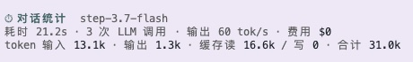

# @marshal/pi-turn-stats

pi extension: conversation statistics (对话统计). For every exchange, records duration, token usage (input / output / cache read / cache write), and cost.

## Features

- **对话流统计卡片** — after each reply, appends a stats card to the conversation stream (not sent to the LLM context).
- **状态栏实时显示** — bottom status bar shows the previous exchange's duration / output speed / tokens / cost.
- **`/turnstats` 命令** — appends a session-cumulative stats card (total exchanges, turns, tokens, cost).

## Screenshots



## Installation

Install project-locally (recommended, supports per-project version pinning):

```bash
# From the GitHub repo, pinned to a git tag (SSH)
pi install -l git:git@github.com:MarshalW/pi-turn-stats@v0.1.0
```

## Note

Generated stats are **local-only** — nothing is uploaded anywhere. Reads `turn_end` event usage data and wall-clock timing inside the running pi process.

## Development

```bash
git clone git@github.com:MarshalW/pi-turn-stats.git
cd pi-turn-stats
pi install ./        # local install for testing
```

## Release flow

```bash
git tag vX.Y.Z && git push origin main --tags
# then on each consumer machine: pi install -l git:...@vX.Y.Z
```